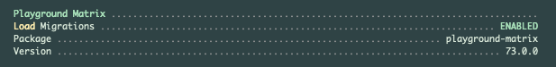

# Playground Matrix

[](https://raw.githubusercontent.com/gammamatrix/playground-matrix/testing/develop/testdox.txt)
[](tests)
[](.github/workflows/ci.yml#L120)

The Playground Matrix is a package for [Laravel](https://laravel.com/docs/10.x) applications.

This application provides the models to use Playground Matrix, a project management tool.

## Installation

You can install the package via composer:

```bash
composer require gammamatrix/playground-matrix
```

## `artisan:about`

Playground Matrix provides information in the `artisan about` command.



## Configuration

Migrations are disabled by default. This package may sometimes be installed where another system handles the migrations.

See the contents of the published config file: [config/playground-matrix.php](config/playground-matrix.php)

You can publish the config file with:
```bash
php artisan vendor:publish --provider="Playground\Matrix\ServiceProvider" --tag="playground-config"
```

### Environment Variables

|  env()                              | config()                            |
|-------------------------------------|-------------------------------------|
| `PLAYGROUND_MATRIX_LOAD_MIGRATIONS` | `playground-matrix.load.migrations` |
- The loading option for migrations does not take effect if the migrations have been exported to your app. The control for loading is handled in the package [ServiceProvider.](src/ServiceProvider.php)

## Models

This package includes [factories](database/factories), models and [migrations](database/migrations) for:
- [Backlogs](src/Models/Backlog.php)
- [Boards](src/Models/Board.php)
- [Epics](src/Models/Epic.php)
- [Flows](src/Models/Flow.php)
- [Milestones](src/Models/Milestone.php)
- [Notes](src/Models/Note.php)
- [Projects](src/Models/Project.php)
- [Releases](src/Models/Release.php)
- [Roadmaps](src/Models/Roadmap.php)
- [Sources](src/Models/Source.php)
- [Sprints](src/Models/Sprint.php)
- [Tags](src/Models/Tag.php)
- [Teams](src/Models/Team.php)
- [Tickets](src/Models/Ticket.php)
- [Versions](src/Models/Version.php)

## Migrations

All migrations are disabled by default.

See the contents of the published config file: [database/migrations](database/migrations)
- NOTE: There are 15 tables that will be created, they do have indexes and unique constraints defined; however, this release does not have the foreign key constraint migrations included at this time.

You can publish the migrations file with:
```bash
php artisan vendor:publish --provider="Playground\Matrix\ServiceProvider" --tag="playground-migrations"
```

## PHPStan

Tests at level 9 on:
- `config/`
- `database/`
- `src/`
- `tests/Feature/`
- `tests/Unit/`

```sh
composer analyse
```

## Coding Standards

```sh
composer format
```

## Testing

```sh
composer test
```

## Changelog

Please see [CHANGELOG](CHANGELOG.md) for more information on what has changed recently.

## Credits

- [Jeremy Postlethwaite](https://github.com/gammamatrix)

## License

The MIT License (MIT). Please see [License File](LICENSE.md) for more information.
