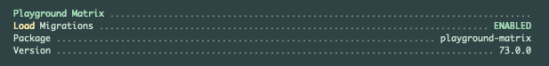

# Playground: Matrix

[](https://raw.githubusercontent.com/gammamatrix/playground-matrix/testing/develop/testdox.txt)
[](tests)
[](.github/workflows/ci.yml#L128)

The Playground Matrix is a package for [Laravel](https://laravel.com/docs/12.x) applications.

Playground: This package provides the models to use Playground Matrix, a Project Management System.

Read more on using [Playground: Matrix at Read the Docs](https://gammamatrix-playground.readthedocs.io/en/develop/built-components/matrix.html)

## Installation

**NOTE:** This package is required by:
- [Playground: Matrix API](https://github.com/gammamatrix/playground-matrix-api): API without UI
- [Playground: Matrix Resource](https://github.com/gammamatrix/playground-matrix-resource): API with UI

Install this package, with composer, to get access to the Matrix Models:

```bash
composer require gammamatrix/playground-matrix
```

## `artisan:about`

Playground Matrix provides information in the `artisan about` command.



## Configuration

Migrations are disabled by default. This package may sometimes be installed where another system handles the migrations.

See the contents of the published config file: [config/playground-matrix.php](config/playground-matrix.php)

You can publish the config file with:
```bash
php artisan vendor:publish --provider="Playground\Matrix\ServiceProvider" --tag="playground-config"
```

### Environment Variables

| env()                               | config()                            | Default |
|-------------------------------------|-------------------------------------|---------|
| `PLAYGROUND_MATRIX_ABOUT`           | `playground-matrix.about`           | `true`  |
| `PLAYGROUND_MATRIX_LOAD_MIGRATIONS` | `playground-matrix.load.migrations` | `false` |
- The loading option for migrations does not take effect if the migrations have been exported to your app. The control for loading is handled in the package [ServiceProvider.](src/ServiceProvider.php)

## Models

This package includes [factories](database/factories), models and [migrations](database/migrations) for:
- [Backlog](src/Models/Backlog.php)
- [Board](src/Models/Board.php)
- [Epic](src/Models/Epic.php)
- [Flow](src/Models/Flow.php)
- [Matrix](src/Models/Matrix.php)
- [Milestone](src/Models/Milestone.php)
- [Note](src/Models/Note.php)
- [Project](src/Models/Project.php)
- [Release](src/Models/Release.php)
- [Roadmap](src/Models/Roadmap.php)
- [Source](src/Models/Source.php)
- [Sprint](src/Models/Sprint.php)
- [Tag](src/Models/Tag.php)
- [Team](src/Models/Team.php)
- [Ticket](src/Models/Ticket.php)
- [Version](src/Models/Version.php)

## Migrations

All migrations are disabled by default.

See the contents of the published config file: [database/migrations](database/migrations)
- NOTE: There are 16 tables that will be created, they do have indexes and unique constraints defined; however, this release does not have the foreign key constraint migrations included at this time.

You can publish the migrations file with:
```bash
php artisan vendor:publish --provider="Playground\Matrix\ServiceProvider" --tag="playground-migrations"
```

## Cloc

```sh
composer cloc
```

```
➜  playground-matrix git:(develop) ✗ composer cloc
     202 text files.
     197 unique files.
      25 files ignored.

github.com/AlDanial/cloc v 2.08  T=0.20 s (961.3 files/s, 342268.5 lines/s)
-------------------------------------------------------------------------------
Language                     files          blank        comment           code
-------------------------------------------------------------------------------
JSON                            89              0              0          50581
PHP                             91           1464           4161          12611
XML                             12              0              7            841
YAML                             1              5              0            275
Markdown                         3             46              0            132
INI                              1              3              0             12
-------------------------------------------------------------------------------
SUM:                           197           1518           4168          64452
-------------------------------------------------------------------------------
```

## PHPStan

Tests at level 10 on:
- `config/`
- `database/`
- `src/`
- `tests/Feature/`
- `tests/Unit/`

```sh
composer analyse
```

## Coding Standards

```sh
composer format
```

## Testing

Unit tests
```sh
composer test
```

Unit and feature tests
```sh
composer test-dev
```

Run unit and feature tests in parallel:
```sh
composer test-parallel
```

## Changelog

Please see [CHANGELOG](CHANGELOG.md) for more information on what has changed recently.

## Credits

- [Jeremy Postlethwaite](https://github.com/gammamatrix)

## License

The MIT License (MIT). Please see [License File](LICENSE.md) for more information.
